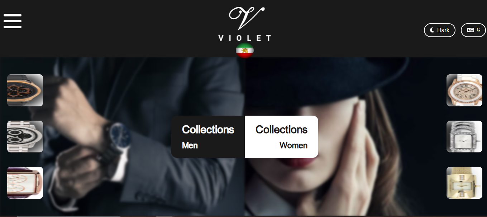
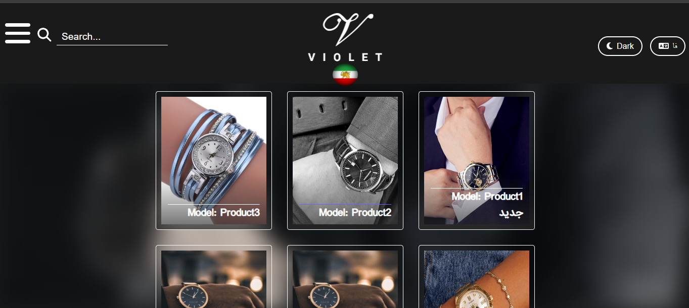
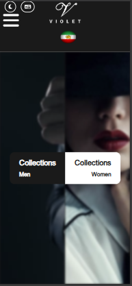

# 🕰️ Violet Watch Store

A fully responsive e-commerce website for a watch store built with PHP, MySQL, and vanilla JavaScript. Features complete bilingual support (Persian/English), dark mode, modular ES6 architecture, and a comprehensive admin panel for product management.


## 🌟 Live Demo

🔗 **[View Live Demo](https://amirtavassoli.ir)**

_Full production site with complete backend functionality and database integration_

## ✨ Features

Frontend

- **🌍 Bilingual Support**: Complete Persian (RTL) and English (LTR) with dynamic language switching
- **📱 Responsive Design**: Mobile-first approach that works on all devices
- **🌙 Dark/Light Theme**: Toggle between themes with localStorage persistence
- **🛍️ Product Management**: Complete CRUD operations for watch inventory
- **🔍 Search & Filter**: Advanced search by name, gender, and specifications
- **📋 Modal System**: Beautiful modals for product details, contact info, and admin login
- **👨‍💼 Admin Panel**: Full product management interface with image upload
- **🗄️ Database Integration**: MySQL backend with secure data handling
- **📄 Pagination**: Efficient product browsing with page navigation

## 🛠️ Tech Stack

- **Frontend**: HTML5, CSS3, Vanilla JavaScript (ES6 Modules)
- **Backend**: PHP 7+
- **Database**: MySQL 5.7+
- **Icons**: Font Awesome 6
- **Design**: Custom responsive design with CSS Grid/Flexbox

## 📸 Screenshots

### 🏠 Main Page



### 🛍️ Product Gallery



### 📱 Mobile Responsive



### 👨‍💼 Admin Panel


### 🌍 Language Support


## 🚀 Quick Start

### Prerequisites

- PHP 7.0 or higher
- MySQL 5.7 or higher
- Web server (Apache/Nginx) or XAMPP/WAMP/LAMP

### Installation

1. **Clone the repository**

   ```bash
   git clone https://github.com/amirtavassoli/violet-watch-store.git
   cd violet-watch-store
   ```

2. **Database Setup**

   ```sql
   -- Create database
   CREATE DATABASE amirSiteDb CHARACTER SET utf8mb4 COLLATE utf8mb4_unicode_ci;

   -- Import the database
   mysql -u your_username -p amirSiteDb < amirsitedb.sql
   ```

3. **Configure Database Connection**

   Update `pages/page2.php` with your database credentials:

   ```php
   $con = mysqli_connect("localhost", "your_username", "your_password", "amirSiteDb");
   ```

4. **Set Permissions**

   ```bash
   chmod 755 pictures/products/
   ```

5. **Access the Application**
   - 🌐 **Live Demo**: [https://www.violetwatch.tech](https://www.violetwatch.tech)
   - 💻 **Local Development**: `http://localhost/violet-watch-store/`

## 📁 Project Structure

```
violet-watch-store/
├── 📄 index.html              # Main application page
├── 📁 pages/
│   ├── 📄 page2.php           # Backend API endpoints
│   └── 📄 admin.html          # Admin panel interface
├── 📁 css/
│   ├── style.css           # Legacy monolithic styles
│   └── components/         # Modular CSS structure
│       ├── base.css        # Base styles and variables
│       ├── header.css      # Header components
│       ├── modal.css       # Modal styles
│       ├── mainAndproducts.css # Main content
│       └── responsive.css  # Media queries
├── 📁 script/
│   ├── script.js           # Main bundled JavaScript (for compatibility)
│   └── modules/            # ES6 modules (development version)
│       ├── config.js       # Configuration and translations
│       ├── ajax.js         # AJAX utilities
│       ├── navigation.js   # Navigation handlers
│       ├── modal.js        # Modal system
│       └── products.js     # Product management
├── 📁 pictures/
│   ├── 📁 products/           # Product images directory
│   ├── 🖼️ logo.png            # Store logo
│   ├── 🖼️ mainLeftPic.jpg     # Main page background (men)
│   ├── 🖼️ mainRightPic.jpg    # Main page background (women)
│   └── 🖼️ ...                 # Other UI images
├── 📁 fonts/
│   └── 📁 awsome/             # Font Awesome icons
├── 📁 screenshots/            # Project screenshots
├── 📄 amirsitedb.sql          # Database structure & sample data
├── 📄 README.md               # This file
├── 📄 .gitignore              # Git ignore rules
└── 📄 LICENSE                 # MIT License
```

## 🔧 API Endpoints

The backend (`page2.php`) provides these endpoints:

| Endpoint     | Method | Parameters               | Description                     |
| ------------ | ------ | ------------------------ | ------------------------------- |
| `select`     | POST   | `name`, `gender`, `page` | Get products with search/filter |
| `insert`     | POST   | Product data + image     | Add new product                 |
| `update`     | POST   | Product data + image     | Update existing product         |
| `delete`     | POST   | `id`, `picUrl`           | Delete product                  |
| `login`      | POST   | `id`, `name`             | Admin authentication            |
| `changePass` | POST   | Password data            | Change admin password           |

## 🌟 Key Features Explained

### 🌍 Bilingual Support

- **Dynamic Language Switching**: Toggle between Persian (RTL) and English (LTR)
- **Translation System**: JavaScript-based translation with proper text direction
- **Cultural Adaptation**: Proper handling of Persian typography and layout

### 🛍️ Product Management

- **Image Upload**: Secure file upload with validation
- **Search System**: Multi-field search across product attributes
- **Pagination**: Efficient loading of large product catalogs
- **Admin Interface**: User-friendly CRUD operations

### 📱 Responsive Design

- **Mobile-First**: Optimized for mobile devices first
- **Flexible Layouts**: CSS Grid and Flexbox for adaptive design
- **Touch-Friendly**: Large buttons and touch targets for mobile
- **Progressive Enhancement**: Works without JavaScript

## 🔐 Admin Panel Features

- ✅ **Product CRUD**: Create, Read, Update, Delete products
- ✅ **Image Management**: Upload and manage product images
- ✅ **Search & Filter**: Find products quickly
- ✅ **Password Management**: Change admin credentials
- ✅ **Responsive Interface**: Works on all devices

## 🎨 Customization

### Changing Colors

Edit CSS custom properties in `css/style.css`:

```css
:root {
  --bg-primary: #1a1a1a;
  --text-primary: white;
  --border-color: white;
}
```

### Adding Languages

Add translations in `script/script.js`:

```javascript
const translations = {
  // Add your language here
  es: {
    home: "Inicio",
    products: "Productos",
    // ... more translations
  },
};
```

## 🔒 Security Notes

⚠️ **Important**: This is a demonstration project. For production use, implement:

- 🔐 **Password Hashing**: Use `password_hash()` and `password_verify()`
- 🛡️ **Prepared Statements**: Prevent SQL injection
- ✅ **Input Validation**: Sanitize all user inputs
- 🔒 **CSRF Protection**: Add CSRF tokens
- 📁 **File Upload Security**: Validate file types and sizes
- 🌐 **HTTPS**: Use SSL certificates
- 🚫 **Error Handling**: Hide sensitive error information

## 🤝 Contributing

Contributions are welcome! Please feel free to submit a Pull Request.

1. Fork the project
2. Create your feature branch (`git checkout -b feature/AmazingFeature`)
3. Commit your changes (`git commit -m 'Add some AmazingFeature'`)
4. Push to the branch (`git push origin feature/AmazingFeature`)
5. Open a Pull Request

## 🐛 Issues

Found a bug? Have a feature request? [Open an issue](https://github.com/amirtavassoli/violet-watch-store/issues)

## 📝 License

This project is licensed under the MIT License - see the [LICENSE](LICENSE) file for details.

## 👨‍💻 Author

**Amir Tavassoli**

- 🌐 Website: [amirtavassoli.ir](https://amirtavassoli.ir)
- 🐙 GitHub: [@amirtavassoli](https://github.com/amirtavassoli)
- 📧 Email: amirtavass62@gmail.com

_Full-stack developer passionate about creating responsive, multilingual web applications_

## 🙏 Acknowledgments

- 🎨 **Font Awesome** for the beautiful icons
- 💡 **Inspiration** from modern e-commerce designs
- 🔤 **Typography** considerations for Persian/Arabic languages
- 🌍 **Open Source Community** for tools and resources

## 📈 Project Stats


---

⭐ **Star this repo if you find it helpful!**
